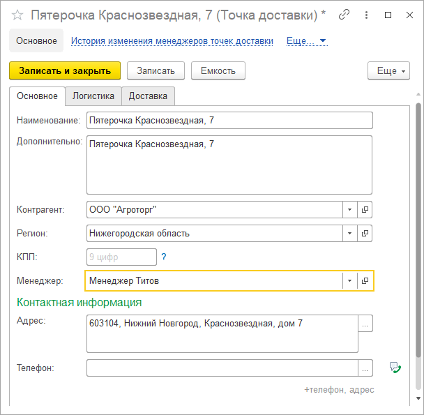
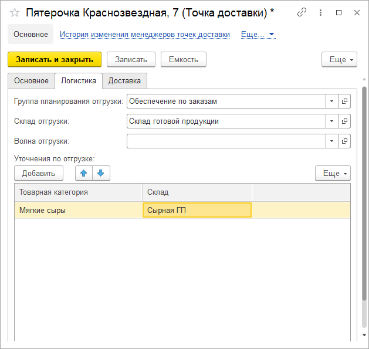
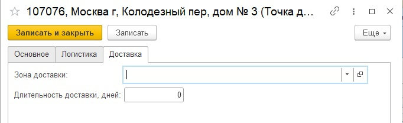
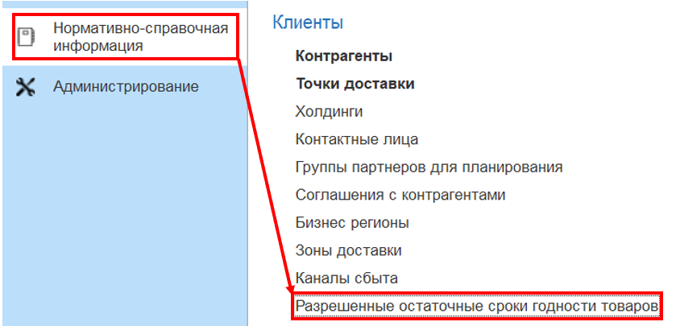

# Точки доставки

В справочнике **"Точки доставки"** указываются торговые точки клиента, до которых будет осуществляться доставка.

**Вкладка "Основное"**

- Наименование
- Дополнительная информация
- [Контрагент](Contractor.md)
- [Регион](../CommonInformation/BusinessRegion.md)
- КПП
- Менеджер
- Контактная информация (адрес и телефон)

 

**Вкладка "Логистика"**

- Группа планирования отгрузки
- Склад отгрузки
- Волна отгрузки
- Уточнения по отгрузке (можно уточнять склад отгрузки для товарной категории)

**Вкладка "Доставка"**

- Зона доставки
- Длительность доставки в днях

**Разрешенные остаточные сроки годности товаров**

В панели навигации можно перейти в регистр "Разрешенные остаточные сроки годности товаров", в котором указывается разрешенный процент ОСГ в разрезе номенклатуры и точки доставки.
