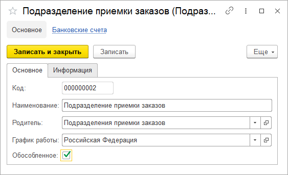

# Подразделения

Справочник **"Подразделения"** предназначен для хранения списков подразделений.

- Наименование
- Родитель - группа подразделений
- График работы
- Обособленное подразделение

Если у подразделения установлен признак обособленности, то в карточке подразделения отображается вкладка **"Информация"** и доступны к заполнению реквизиты, которые указываются в печатных формах для грузоотправителя.

**Вкладка "Информация"**

[![2][2]][2]

- Основной банковский счет

*"Юридические данные"*

- Наименования: сокращенное, международное, полное
- ИНН
- КПП
- ОГРН
- ОКПО
- Код ОКВЭД

*"Контактная информация"*

- Адрес
- Телефон

[2]:Department.assets/2.png
