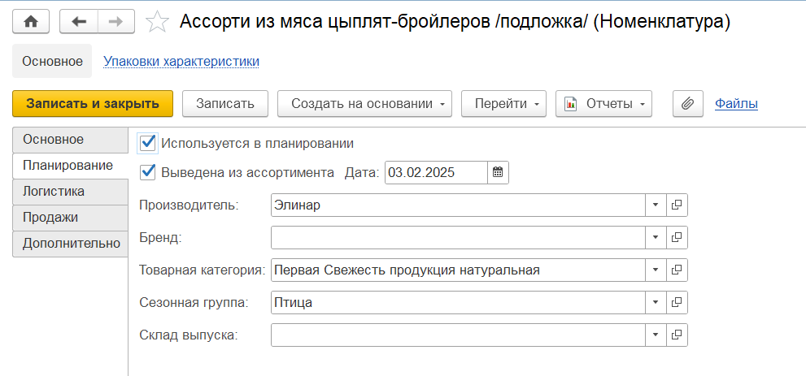

# Номенклатура

В справочнике **"Номенклатура"** хранится весь ассортимент продукции.

**Вкладка "Основное"**:

- Папка номенклатуры
- Код (заполняется автоматически)
- Артикул
- Наименование - рабочее и для печати
- [Вид номенклатуры](KindOfNomenclature.md)
- Использование характеристик (заполняется по виду номенлатуры)
- Использование серий  (заполняется по виду номенлатуры)
- Тип номенклатуры: готовая продукция, базовый продукт, упаковка, сырье, тара, многооборотная тара
- Использование упаковок: индивидуальный набор, общий набор
- Единица хранения
- Переменное количество: истина - весовая, ложь - фиксированный вес
- Дополнительные единицы измерения
- Изображение
- Текстовое описание

**Вкладка "Планирование"**:

- Использование в планировании - этот признак устанавливается для той номенклатуры, которая должна попасть в планирование по SKU
- Производитель
- Бренд
- [Товарная категория](РroductCategory.md)
- Сезонная группа
- Склад выпуска

**Вкладка "Производство"**:

Появляется для номенклатуры с типом номенклатуры *"Базовый продукт"*

[![3][3]][3]

- Текущий нормативный запас
- Табличная часть, содержащая список готовой продукции, производимой из данного базового продукта

**Вкладка "Продажи"**:

[![4][4]][4]

- Ставка НДС: 20%, 18%, 10%, 0%, Без НДС

**Вкладка "Логистика"**:

- Упаковка по умолчанию
- Кратность

**Вкладка "Дополнительно"**:

[![6][6]][6]

- Срок годности
- В чем указывается срок годности
- Комментарий

[3]:Nomenclature.assets/3.png
[4]:Nomenclature.assets/4.png
[6]:Nomenclature.assets/6.png