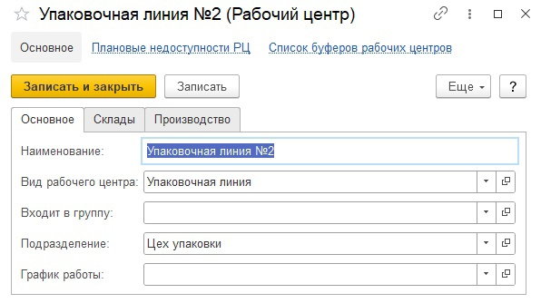
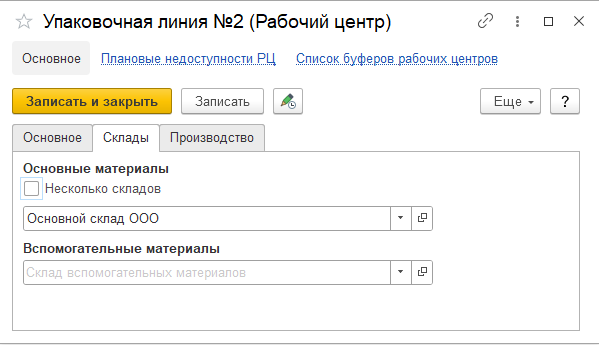
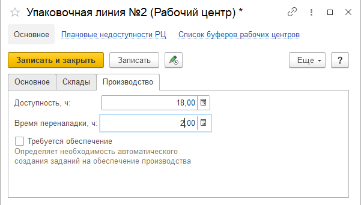

# Рабочие центры

Справочник **"Рабочие центры"** предназначен для ведения списка доступного оборудования. Справочник **Рабочие центры** расположен в подсистеме **"Нормативно-справочная информация"**.

**Вкладка "Основное"**

- Наименование
- Вид рабочего центра
- Входит в группу: есть возможность объединить рабочие центры в группы (например сгруппировать по складу)
- Подразделение - указывается подразделение организации, к которому относится данный РЦ (Рабочий центр)
- График работы

**Вкладка "Склады"**

- Использование одного склада или нескольких
- Склад, на котором функционирует данный РЦ
 
**Вкладка "Производство"**

- Доступность, часы
- Время переналадки, часы
- Требуется обеспечение или нет